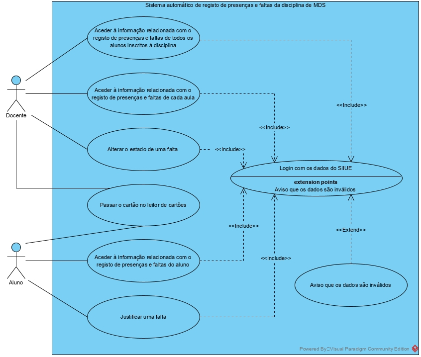
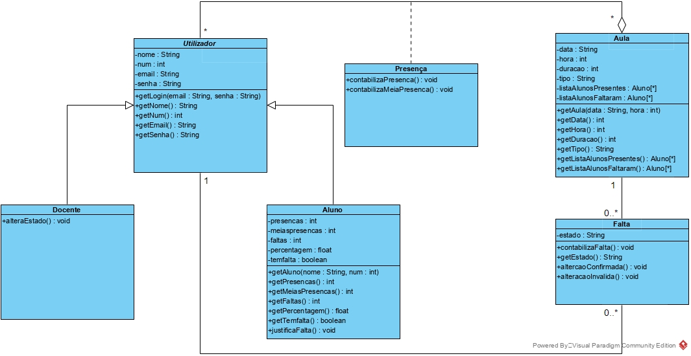
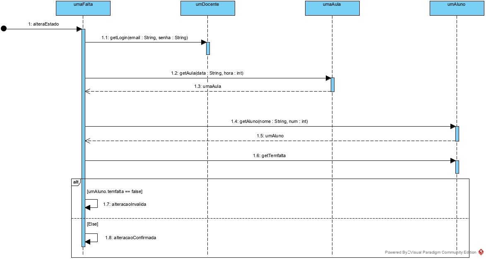
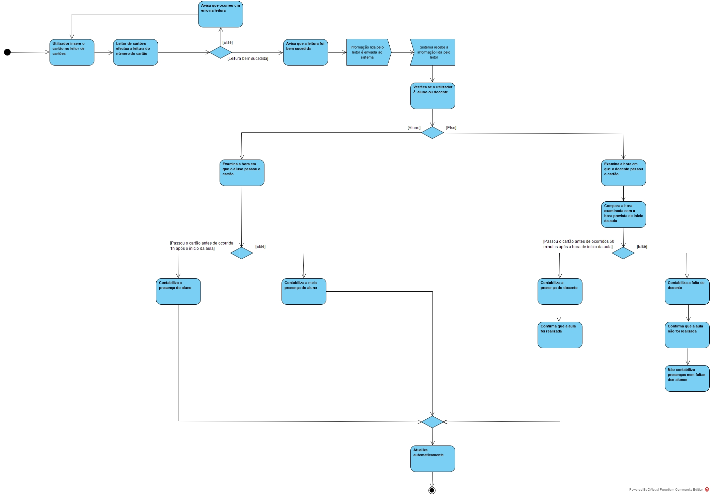

# **MDS Final Project Part 1 Report - Specification (in Portuguese)**

## **Requisitos de utilizador**

1\. "O utilizador deve conseguir registar a presença numa aula através da leitura do seu cartão."

2\. "O utilizador deve conseguir autenticar-se através dos dados do SIIUE."

3\. "O utilizador, no caso de se tratar de um docente, deve conseguir aceder à informação atualizada relacionada com o registo de presenças e faltas de todos os alunos inscritos à disciplina."

4\. "O utilizador, no caso de se tratar de um docente, deve conseguir aceder à informação atualizada relacionada com o registo de presenças e faltas de cada aula."

5\. "O utilizador, no caso de se tratar de um aluno, deve conseguir aceder à informação atualizada relacionada com o registo de presenças e faltas do aluno."

6\. "O utilizador, no caso de se tratar de um docente, pode alterar o estado de uma falta de um aluno"

7\. "O utilizador, no caso de se tratar de um aluno, pode adicionar uma justificação a uma falta."

## **Requisitos de sistema**

1.1. "Na hora da aula, o docente e os alunos passam os seus cartões no leitor de cartões, sendo contabilizada a sua presença nessa aula."

1.2. "Quando o docente não passa o seu cartão ao fim de 50 minutos desde a hora prevista de início da aula, considera-se que não houve aula e, consequentemente, não são contabilizadas as faltas."

1.3. "Se um aluno passa o seu cartão depois de decorrida 1h sobre a hora prevista de início da aula, apenas será considerada meia presença."

1.4. "Após decorrido o tempo de duração da aula, se aluno não tiver passado o seu cartão, deve ser contabilizado como falta injustificada."

2.1. "O sistema deve importar a lista de alunos inscritos à disciplina a partir do SIIUE."

2.2. "O sistema deve importar a lista de docentes que lecionam a disciplina a partir do SIIUE."

2.3. "Deve ser permitida a entrada no sistema através do email e da palavra-passe da conta do SIIUE do utilizador."

3.1. "O sistema deve apresentar a lista de todos os alunos inscritos com o respetivo nome completo e número de aluno; número de presenças, meias presenças, faltas justificadas e faltas injustificadas; e a percentagem de faltas."

4.1. "O sistema deve possuir uma configuração persistente, onde estão definidas as aulas (data, hora, duração e tipo)."

4.2. "O sistema deve apresentar a lista dos alunos presentes ou com meia presença com o nome completo e número de aluno de cada um; e a lista dos alunos que faltaram com o nome completo e número de aluno de cada um, com a informação sobre se a falta se encontra justificada ou injustificada, e no caso de se encontrar justificada, é mostrada uma anotação com a justificação do aluno."

5.1. "O sistema apresentar a contabilização das presenças e faltas de cada aluno como o número de presenças, meias presenças, faltas, percentagem de faltas, informação se o aluno esteve presente ou faltou a uma aula e se neste último caso, se a falta foi justificada ou injustificada."

6.1. "O docente pode alterar o estado de faltas como justificadas ou injustificadas, em qualquer momento."

6.2. "Sempre que um aluno atinja 25% de faltas, o sistema deve enviar um email ao aluno e outro aos docentes a informar sobre esta situação."

6.3. "Sempre que um aluno atinja 50% de faltas, o sistema deve enviar um email ao aluno, aos docentes e ao director de curso a informar sobre esta situação."

6.4. "O sistema deve avaliar as condições acima, a cada hora de aula."

7.1. "No caso de o utilizador se tratar de um aluno, este pode adicionar uma justificação a uma determinada falta com um prazo de 1 semana desde da aula em que faltou."

"Toda a informação do sistema deve estar guardada numa base de dados."

"O sistema deve ser atualizado automaticamente quando verificada qualquer alteração."

"O sistema deve gerar um relatório no final do semestre com toda a informação relacionada com a contabilização de faltas e presenças que inclui a listagem de alunos com o número de presenças e respetiva percentagem, um gráfico com as presenças por aula ao longo do tempo, uma lista dos alunos com entre 25% e 50% de faltas e uma lista dos alunos com mais de 50% de faltas."

---

## **Use Case 1**

### **Nome**: Passar o cartão no leitor de cartões

- #### Ator principal: Aluno 

- #### Comportamento normal:

   **1.** Aluno insere o cartão no leitor de cartões.
    
   **2.** Leitor de cartões efetua a leitura do número do cartão.
   
   **3.** Leitor de cartões confirma que a leitura foi bem sucedida.
   
   **4.** Leitor de cartões envia essa informação ao sistema automaticamente.

   **5.** Sistema recebe a informação enviada pelo leitor de cartões e verfica se pertence a um aluno inscrito na disciplina ou a um docente que leciona a disciplina.

   **6.** Sistema confirma que é um aluno e examina a hora em que o mesmo passou o cartão e faz uma comparação com a hora prevista de início da aula.

   **7.** Sistema confirma que o aluno passou o cartão antes de ocorrida 1h após a hora de prevista de ínicio da aula.
   
   **8.** Sistema contabiliza a presença do aluno na aula.

   **9.** Sistema é atualizado automaticamente.

- #### Extensões:

   **3a.** Sistema avisa que ocorreu um erro na leitura e volta ao passo 1.

   **7a.** Sistema confirma que o aluno passou o cartão 1h após a hora prevista de início da aula.
   
   1. Sistema contabiliza a meia presença do aluno e volta ao passo 9.

---

- #### Ator principal: Docente

- #### Comportamento normal:

   **1.** Docente insere o cartão no leitor de cartões.
    
   **2.** Leitor de cartões efetua a leitura do número do cartão.
   
   **3.** Leitor de cartões confirma que a leitura foi bem sucedida.
   
   **4.** Leitor de cartões envia essa informação ao sistema automaticamente.

   **5.** Sistema recebe a informação enviada pelo leitor de cartões e verfica se pertence a um aluno inscrito na disciplina ou a um docente que leciona a disciplina.

   **6.** Sistema confirma que é um docente e examina a hora em que o mesmo passou o cartão e faz uma comparação com a hora prevista de início da aula.

   **7.** Sistema confirma que o docente passou o cartão antes de ocorridos 50 minutos após a hora de prevista de ínicio da aula.

   **8.** Sistema contabiliza presença do docente e confirma que a aula foi realizada.

   **9.** Sistema é atualizado automaticamente.

- #### Extensões:

   **3a.** Sistema avisa que ocorreu um erro na leitura e volta ao passo 1.
   
   **7a.** Sistema confirma que o docente não passou o cartão ao fim de 50 minutos após a hora prevista de início da aula.
   
   1. Sistema contabiliza falta do docente e confirma que a aula não foi realizada.
   2. Sistema não contabiliza presenças nem faltas dos alunos e volta ao passo 7.

---

## **Use Case 2**

### **Nome**: Aceder à informação relacionada com o registo de presenças e faltas do aluno

- #### Ator principal: Aluno

- #### Comportamento normal:
  
   **1.** Sistema pede ao aluno para se autenticar com o email e a palavra-passe do SIIUE.

   **2.** Sistema verifica se os dados introduzidos existem no SIIUE.

   **3.** Sistema valida o acesso confirmando que se trata de um aluno inscrito à disciplina.

   **4.** É apresentado no ecrã a seguinte informação: o número de presenças, meias presenças, faltas e percentagem de faltas do aluno; e a lista das aulas (data, a hora, a duração e o tipo) com a informação se o aluno esteve presente ou faltou e se neste último caso se a falta foi justificada ou injustificada.

- #### Extensões:

   **3a.** Se os dados introduzidos forem inválidos, o sistema avisa o aluno e volta ao passo 1.

---

## **Use Case 3**

### **Nome**: Aceder à informação relacionada com o registo de presenças e faltas de todos os alunos inscritos à disciplina

- #### Ator principal: Docente

- #### Comportamento normal:

   **1.** Sistema pede ao docente para se autenticar com o email e a palavra-passe do SIIUE.

   **2.** Sistema verifica se os dados introduzidos existem no SIIUE.

   **3.** Sistema valida o acesso confirmando que se trata de um docente que leciona a disciplina.

   **4.** Docente seleciona a opção de aceder à informação relacionada com o registo de presenças e faltas de todos os alunos inscritos à disciplina.
   
   **5.** É apresentado no ecrã a seguinte informação: a lista de todos os alunos inscritos com o respetivo nome completo e número de aluno; número de presenças, meias presenças, faltas justificadas e faltas injustificadas; e a percentagem de faltas.

- #### Extensões:

   **3a.** Se os dados introduzidos forem inválidos, o sistema avisa o docente e volta ao passo 1.

---

## **Use Case 4**

### **Nome**: Aceder à informação relacionada com o registo de presenças e faltas de cada aula

- #### Ator principal: Docente

- #### Comportamento normal:

   **1.** Sistema pede ao docente para se autenticar com o email e a palavra-passe do SIIUE.

   **2.** Sistema verifica se os dados introduzidos existem no SIIUE.

   **3.** Sistema valida o acesso confirmando que se trata de um docente que leciona a disciplina.

   **4.** Docente seleciona a opção de aceder à informação relacionada com o registo de presenças e faltas de cada aula.

   **5.** Sistema pede ao docente para introduzir a aula (dia e hora) que pretende aceder.

   **6.** Sistema confirma que existe informação sobre a aula indroduzida pelo docente.

   **7.** É apresentado no ecrã a seguinte informação: a lista dos alunos presentes ou com meia presença com o nome completo e número de aluno de cada um; e a lista dos alunos que faltaram com o nome completo e número de aluno de cada um, com a informação sobre se a falta se encontra justificada ou injustificada, e no caso de se encontrar justificada, é mostrada uma anotação com a justificação do aluno.

- #### Extensões:

   **3a.** Se os dados introduzidos forem inválidos, o sistema avisa o docente e volta ao passo 1.

   **6a.** Se os dados introduzidos forem inválidos, o sistema avisa o docente e volta ao passo 5.

---

## **Use Case 5**

### **Nome**: Alterar o estado de uma falta

- #### Ator principal: Docente

- #### Comportamento normal:

   **1.** Sistema pede ao docente para se autenticar com o email e a palavra-passe do SIIUE.

   **2.** Sistema verifica se os dados introduzidos existem no SIIUE. 

   **3.** Sistema valida o acesso confirmando que se trata de um docente que leciona a disciplina.

   **4.** Docente seleciona a opção de aceder à informação relacionada com o registo de presenças e faltas de cada aula.

   **5.** Sistema pede ao docente para introduzir a aula (dia e hora) que pretende aceder.

   **6.** Sistema confirma que existe informação sobre a aula indroduzida pelo docente.

   **7.** Docente seleciona a opção de alterar estado de falta.

   **8.** Sistema pede ao docente para introduzir o aluno (nome e numero) a que pretende alterar o estado da falta.

   **9.** Sistema verifica se o aluno tem falta na aula introduzida.

   **10.** Sistema confirma que o aluno introduzido tem falta.

   **11.** Sistema pede ao docente se pretende alterar o estado da falta para justificada ou injusticada.

   **12.** Sistema confirma a alteração e analisa a percentagem de faltas do aluno ao qual o estado da falta foi alterado.

   **13.** Sistema confirma que a percentagem de faltas do aluno encontra-se abaixo dos 25%.
   
   **14.** Sistema atualiza automaticamente.

- #### Extensões:

   **3a.** Se os dados introduzidos forem inválidos, o sistema avisa o docente e volta ao passo 1.

   **6a.** Se os dados introduzidos forem inválidos, o sistema avisa o docente e volta ao passo 5.

   **10a.** Se os dados introduzidos forem inválidos, o sistema avisa o docente e volta ao passo 8.

   **13a.** O sistema confirma que a percentagem de faltas do aluno é de 25%.

   1. Sistema envia automaticamente um email ao aluno e outro aos docentes que lecionam a disciplina a informar sobre a situação e volta ao passo 14.
   
   **13b.** O sistema confirma que a percentagem de faltas do aluno é de 50%.
   
   1. Sistema envia automaticamente um email ao aluno, aos docentes que lecionam a disciplina e ao diretor de curso a informar sobre a situação e volta ao passo 14.

---

## **Use Case 6**

### **Nome**: Justificar uma falta

- #### Ator principal: Aluno

- #### Comportamento normal:

   **1.** Sistema pede ao aluno para se autenticar com o email e a palavra-passe do SIIUE.

   **2.** Sistema verifica se os dados introduzidos existem no SIIUE.

   **3.** Sistema valida o acesso confirmando que se trata de um aluno inscrito à disciplina.

   **4.** Aluno seleciona a opção de justificar uma falta.

   **5.** Sistema pede ao aluno para introduzir a aula (dia e hora) que pretende justificar a falta.

   **6.** Sistema verifica se o aluno tem falta na aula introduzida e se o estado desta encontra-se como injustificada.

   **7.** Sistema confirma que o aluno tem falta injustificada na aula introduzida e compara a data da mesma com a data atual (momento em que o aluno está a proceder à justificação).

   **8.** Sistema confirma que a justificação está a ser feita no período de 1 semana após a aula em que o aluno tem falta.

   **9.** Sistema pede ao aluno para introduzir a sua justificação e submetê-la.

   **10.** Sistema confirma que a justificação foi submetida, esta é enviada por email aos docentes que lecionam a disciplina e o sistema atualiza automaticamente.

- #### Extensões:
   
   **3a.** Se os dados introduzidos forem inválidos, o sistema avisa o aluno e volta ao passo 1.

   **7a.** Se o aluno não tem falta injustificada na aula introduzida ou se a aula introduzida é inválida, o sistema avisa o aluno e volta para o passo 5.

   **8a.** Se o período de 1 semana após a aula em que o aluno tem falta é excedido, o sistema não autoriza o aluno a avançar com a justificação e volta ao passo 5.

---

## ***Diagrama de Use Cases***

## ***Diagrama de Classes***

## ***Diagrama de Sequências - Alterar estado de uma falta***

## ***Diagrama de Atividades - Passar cartão do leitor***

